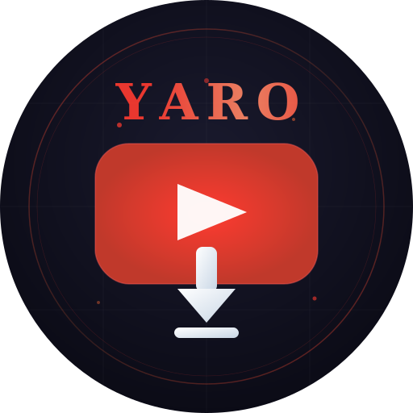

# YouTube Downloader Telegram Bot

<div align="center">
  
  
  <p><strong>Telegram бот для получения прямых ссылок на скачивание YouTube видео</strong></p>
  
  [](https://nodejs.org/)
  [](LICENSE)
  [](https://core.telegram.org/bots)
</div>

---

## 📋 Описание

Telegram бот для получения прямых ссылок на скачивание видео с YouTube в различных качествах. Бот анализирует видео через **yt-dlp**, предоставляет пользователю выбор качества через inline кнопки и возвращает прямую ссылку на скачивание.

### ✨ Преимущества

- 🚀 **Быстрая работа** - только получение метаданных, без скачивания файлов
- 💾 **Не требует места на сервере** - прямые ссылки от YouTube
- 🎯 **Простой интерфейс** - inline кнопки для выбора качества
- 🔒 **Безопасность** - rate limiting и валидация входных данных
- 📊 **Логирование** - полное логирование всех действий

---

## 🎬 Функционал

1. Пользователь отправляет ссылку на YouTube видео
2. Бот анализирует видео и получает доступные форматы
3. Бот отправляет inline кнопки с вариантами качества (1080p, 720p, 480p, 360p, 240p)
4. При нажатии на кнопку бот отправляет прямую ссылку на скачивание
5. Пользователь может скопировать ссылку или перейти по ней для скачивания

### Поддерживаемые форматы

- 🎬 **1080p** - Full HD качество
- 🎬 **720p** - HD качество
- 🎬 **480p** - Стандартное качество
- 🎬 **360p** - Мобильное качество
- 🎬 **240p** - Низкое качество

---

## 🛠 Технологический стек

- **Node.js** (v18+)
- **node-telegram-bot-api** - работа с Telegram Bot API
- **yt-dlp** - получение информации о видео и прямых ссылок
- **Jest** - unit тестирование
- **fast-check** - property-based тестирование

---

## 📦 Установка

### 1. Клонирование репозитория

```bash
git clone https://github.com/yourusername/youtube-downloader-bot.git
cd youtube-downloader-bot
```

### 2. Установка yt-dlp

**Linux/macOS:**
```bash
sudo curl -L https://github.com/yt-dlp/yt-dlp/releases/latest/download/yt-dlp -o /usr/local/bin/yt-dlp
sudo chmod a+rx /usr/local/bin/yt-dlp
```

**Windows:**
```bash
# Скачать yt-dlp.exe с https://github.com/yt-dlp/yt-dlp/releases
# Поместить в папку проекта или добавить в PATH
```

**Через pip:**
```bash
pip install yt-dlp
```

### 3. Установка зависимостей Node.js

```bash
npm install
```

### 4. Настройка переменных окружения

Создайте файл `.env` в корне проекта:

```env
# Telegram Bot Token (получить у @BotFather)
TELEGRAM_BOT_TOKEN=your_bot_token_here

# Опционально: ограничение пользователей (через запятую)
ALLOWED_USERS=

# Опционально: максимальная длительность видео в секундах (по умолчанию 3600)
MAX_VIDEO_DURATION=3600

# Режим разработки
NODE_ENV=development
```

### 5. Получение токена бота

1. Откройте Telegram и найдите [@BotFather](https://t.me/BotFather)
2. Отправьте команду `/newbot`
3. Следуйте инструкциям для создания бота
4. Скопируйте полученный токен в `.env` файл

---

## 🚀 Запуск

### Режим production

```bash
npm start
```

### Режим разработки (с автоперезагрузкой)

```bash
npm run dev
```

### Запуск тестов

```bash
# Все тесты
npm test

# Тесты в watch режиме
npm run test:watch

# Property-based тесты
npm run test:property
```

---

## 📖 Использование

### Команды бота

- `/start` - Приветственное сообщение и инструкция
- `/help` - Справка по использованию бота

### Пример использования

1. Отправьте боту ссылку на YouTube видео:
   ```
   https://www.youtube.com/watch?v=dQw4w9WgXcQ
   ```

2. Бот отправит сообщение с информацией о видео и кнопками выбора качества:
   ```
   🎬 Название видео
   ⏱ Длительность: 3:33
   
   [🎬 1080p MP4 (250 MB)]
   [🎬 720p MP4 (120 MB)]
   [🎬 480p MP4 (60 MB)]
   ```

3. Нажмите на кнопку с нужным качеством

4. Бот отправит прямую ссылку на скачивание:
   ```
   ✅ Прямая ссылка на скачивание (1080p):
   https://...
   
   ⚠️ Ссылка действительна 6-12 часов
   ```

---

## 🏗 Структура проекта

```
youtube-downloader-bot/
├── .env                    # Переменные окружения (не в git)
├── .env.example           # Пример переменных окружения
├── .gitignore             # Игнорируемые файлы
├── package.json           # Зависимости проекта
├── bot.js                 # Главный файл бота
├── ava.svg                # Логотип бота
├── README.md              # Документация
├── src/
│   ├── ytdlp.js          # Модуль работы с yt-dlp
│   ├── telegram.js       # Модуль работы с Telegram
│   └── utils.js          # Вспомогательные функции
├── config/
│   └── config.js         # Конфигурация приложения
├── tests/
│   ├── unit/             # Unit тесты
│   ├── property/         # Property-based тесты
│   └── integration/      # Integration тесты
└── .kiro/
    └── specs/            # Спецификации проекта
        └── youtube-downloader-bot/
            ├── requirements.md
            ├── design.md
            └── tasks.md
```

---

## 🔒 Безопасность

### Rate Limiting

Бот ограничивает количество запросов от одного пользователя:
- **5 запросов** в течение **60 секунд**
- При превышении лимита пользователь получает сообщение с временем до сброса

### Валидация

- Проверка всех входящих URL на соответствие YouTube формату
- Санитизация user input перед логированием
- Timeout для yt-dlp команд (30 секунд для метаданных, 15 секунд для ссылок)

### Whitelist (опционально)

Можно ограничить доступ к боту через переменную `ALLOWED_USERS`:

```env
ALLOWED_USERS=123456789,987654321
```

---

## 📊 Логирование

Бот логирует все действия в формате:

```
[2026-03-10 15:30:45] INFO: USER: @username (123456) | URL: https://youtube.com/...
[2026-03-10 15:30:47] INFO: SUCCESS: Found 8 formats
[2026-03-10 15:30:50] INFO: CALLBACK: User selected 1080p format
```

---

## 🧪 Тестирование

Проект использует комплексный подход к тестированию:

### Unit Tests (Jest)

Тестирование отдельных модулей и функций:
- URLValidator
- Formatter
- RateLimiter
- Logger
- Config

### Property-Based Tests (fast-check)

Тестирование универсальных свойств корректности:
- URL Validation Consistency
- Format Filtering Completeness
- Callback Data Round Trip
- Rate Limiter Enforcement
- File Size Formatting Correctness
- Duration Formatting Correctness
- И другие...

### Integration Tests

Тестирование взаимодействия компонентов:
- Bot Controller + Telegram Helper
- Video Processor + yt-dlp
- Полный flow: URL → форматы → выбор → ссылка

---

## 🚢 Деплой

### VPS (Рекомендуется)

**Требования:**
- CPU: 1-2 ядра
- RAM: 1-2 GB
- Storage: 10 GB
- OS: Ubuntu 22.04 LTS

**Установка на VPS:**

```bash
# Клонирование репозитория
git clone https://github.com/yourusername/youtube-downloader-bot.git
cd youtube-downloader-bot

# Установка зависимостей
npm install

# Установка yt-dlp
sudo curl -L https://github.com/yt-dlp/yt-dlp/releases/latest/download/yt-dlp -o /usr/local/bin/yt-dlp
sudo chmod a+rx /usr/local/bin/yt-dlp

# Настройка .env
nano .env

# Установка PM2
npm install -g pm2

# Запуск бота
pm2 start bot.js --name youtube-bot

# Автозапуск при перезагрузке
pm2 startup
pm2 save
```

### Docker (опционально)

```dockerfile
FROM node:18-alpine

RUN apk add --no-cache python3 py3-pip
RUN pip3 install yt-dlp

WORKDIR /app
COPY package*.json ./
RUN npm install --production

COPY . .

CMD ["node", "bot.js"]
```

---

## 🔧 Обслуживание

### Регулярные задачи

**Обновление yt-dlp (раз в неделю):**
```bash
yt-dlp -U
```

**Обновление зависимостей Node.js:**
```bash
npm update
```

**Проверка логов:**
```bash
pm2 logs youtube-bot
```

**Перезапуск бота:**
```bash
pm2 restart youtube-bot
```

---

## ⚠️ Известные ограничения

1. **Прямые ссылки временные** - живут 6-12 часов
2. **YouTube может блокировать** - нужно регулярно обновлять yt-dlp
3. **Ограничения Telegram** - размер сообщения, количество кнопок
4. **Rate limits YouTube** - при большой нагрузке

---

## 🗺 Roadmap

### Phase 2
- [ ] Поддержка аудио (MP3)
- [ ] Поддержка плейлистов
- [ ] Скачивание субтитров
- [ ] История запросов пользователя

### Phase 3
- [ ] Кэширование в Redis
- [ ] База данных для статистики
- [ ] Админ панель
- [ ] Поддержка других платформ (Vimeo, Dailymotion)

---

## 🤝 Вклад в проект

Contributions are welcome! Пожалуйста:

1. Fork проект
2. Создайте feature branch (`git checkout -b feature/AmazingFeature`)
3. Commit изменения (`git commit -m 'Add some AmazingFeature'`)
4. Push в branch (`git push origin feature/AmazingFeature`)
5. Откройте Pull Request

---

## 📝 Лицензия

Этот проект распространяется под лицензией MIT. См. файл [LICENSE](LICENSE) для подробностей.

---

## 🔗 Полезные ссылки

- [yt-dlp GitHub](https://github.com/yt-dlp/yt-dlp)
- [yt-dlp документация](https://github.com/yt-dlp/yt-dlp#usage-and-options)
- [node-telegram-bot-api](https://github.com/yagop/node-telegram-bot-api)
- [Telegram Bot API](https://core.telegram.org/bots/api)
- [Создание бота через @BotFather](https://core.telegram.org/bots#6-botfather)

---

## 📧 Контакты

Если у вас есть вопросы или предложения, создайте [Issue](https://github.com/yourusername/youtube-downloader-bot/issues) в репозитории.

---

<div align="center">
  <p>Сделано с ❤️ для сообщества</p>
  <p>⭐ Поставьте звезду, если проект вам понравился!</p>
</div>
